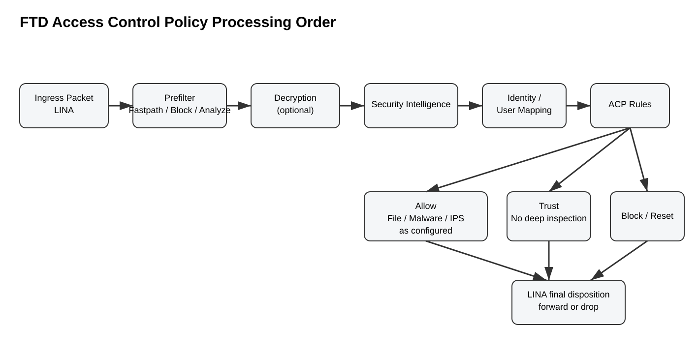
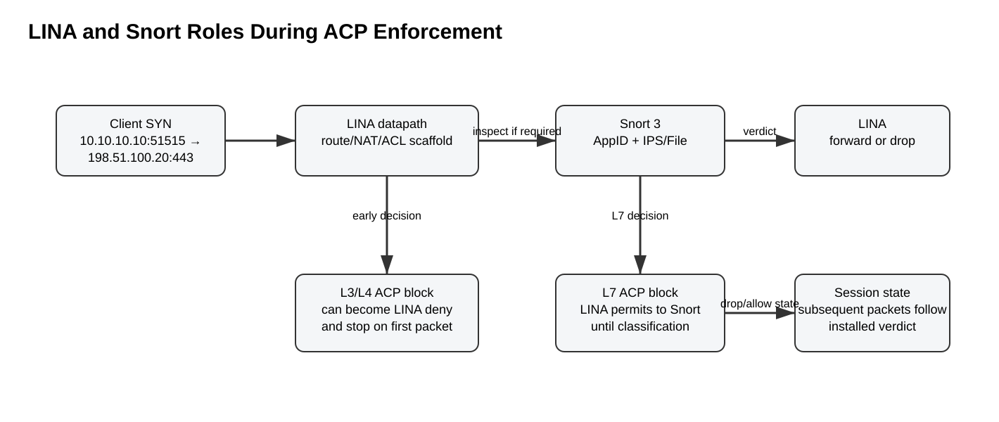
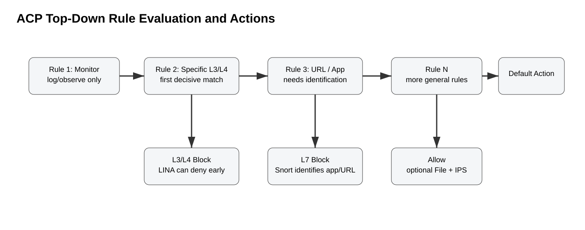
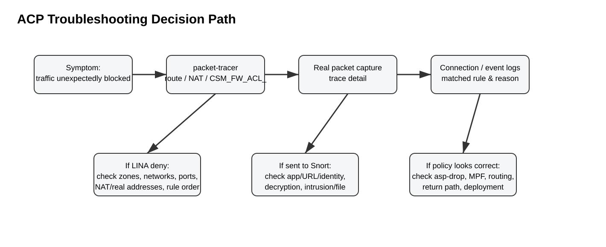

# Cisco Secure Firewall Threat Defense — Access Control Policy Processing Deep Dive

> Scope: Cisco Secure Firewall Threat Defense (FTD) managed primarily by Firewall Management Center (FMC), with notes that also apply conceptually to FDM/Security Cloud Control where documented. This guide focuses on how an Access Control Policy (ACP) is processed, how LINA and Snort 3 divide enforcement, why rules sometimes appear to “allow first and block later,” and how to troubleshoot policy decisions without confusing routing/NAT behavior with ACP behavior.

## Table of contents

- [1. Executive summary](#1-executive-summary)
- [2. Where ACP fits in the FTD architecture](#2-where-acp-fits-in-the-ftd-architecture)
- [3. Pre-ACP processing stages](#3-pre-acp-processing-stages)
- [4. ACP rule evaluation logic](#4-acp-rule-evaluation-logic)
- [5. ACP actions in depth](#5-acp-actions-in-depth)
- [6. L3/L4 versus L7 blocking: why the first packets differ](#6-l3l4-versus-l7-blocking-why-the-first-packets-differ)
- [7. URL and application matching caveats](#7-url-and-application-matching-caveats)
  - [7.11 File Control: blocking EXE and other file types](#711-file-control-blocking-exe-and-other-file-types)
- [8. Default action](#8-default-action)
- [9. End-to-end example](#9-end-to-end-example)
- [10. Save versus Deploy](#10-save-versus-deploy)
- [11. Verification and troubleshooting workflow](#11-verification-and-troubleshooting-workflow)
- [12. Troubleshooting by symptom](#12-troubleshooting-by-symptom)
- [13. Common mistakes](#13-common-mistakes)
- [14. Version notes and newer behavior](#14-version-notes-and-newer-behavior)
  - [14.1 Snort 3](#141-snort-3)
  - [14.2 FMC 10.0 access-control-related changes](#142-fmc-100-access-control-related-changes)
  - [14.3 EVE: what it is and why it can matter to ACP](#143-eve-what-it-is-and-why-it-can-matter-to-acp)
- [15. Design checklist](#15-design-checklist)
- [16. Source information vs explanation vs inference](#16-source-information-vs-explanation-vs-inference)
- [17. References](#17-references)

## 1. Executive summary

An ACP is the main stateful security policy that determines whether a new connection is trusted, blocked, monitored, or allowed for deeper inspection. However, **ACP rules do not operate in isolation and are not necessarily the first security stage a packet encounters**.

A useful mental model for modern FTD is:

1. The packet enters the FTD data plane and is handled first by **LINA**.
2. LINA performs core firewall datapath functions such as interface/zone context, state lookup, routing, NAT, and the compiled L3/L4 access-control scaffold.
3. A **Prefilter Policy** can fastpath, block, or send traffic for analysis.
4. If configured, **Decryption Policy** processing can decrypt TLS before ACP evaluation, block the encrypted flow, or leave it encrypted.
5. **Security Intelligence** can block known-bad IP/domain/URL destinations before normal ACP rule handling.
6. Identity/user mapping and some decoding/preprocessing can occur before ACP rule evaluation.
7. ACP rules are evaluated top-down. In most cases the first decisive matching rule handles the connection. A Monitor rule is a special case: it logs/matches but evaluation continues.
8. Pure L3/L4 block decisions can often be enforced immediately by LINA. L7 decisions such as application identification may require Snort to observe multiple packets before deciding.
9. If an Allow/Interactive Block rule has an intrusion or file policy, allowed traffic is then subjected to that deeper inspection.
10. LINA ultimately forwards or drops based on the locally enforceable decision and, where Snort is involved, Snort’s returned verdict.



[Editable draw.io](../images/09-09-26-18-50_ftd-acp-processing-order.drawio)

## 2. Where ACP fits in the FTD architecture

FTD is not simply “ASA plus Snort.” It is a unified firewall datapath in which **LINA** and **Snort** cooperate.

### LINA responsibilities relevant to ACP

LINA provides the classic stateful-firewall/data-plane functions, including:

- ingress/egress interface handling;
- connection/session state;
- route lookup and forwarding;
- NAT and UN-NAT processing;
- L3/L4 enforcement that can be represented in the compiled global ACL (`CSM_FW_ACL_`);
- enforcement of a final Snort permit/drop verdict;
- several protocol/datapath checks outside Snort.

### Snort responsibilities relevant to ACP

Snort 3 supplies the inspection context that LINA cannot determine from only packet headers, including:

- application identification (AppID);
- URL/category/reputation matching when deeper parsing is required;
- file inspection and malware-related policy handling;
- intrusion inspection;
- decoders, preprocessors/inspectors, and protocol awareness;
- a permit/drop verdict returned to LINA for flows sent to Snort.

### Important implication

A rule that looks like “Block HTTP” in FMC is not necessarily compiled as a simple LINA deny. LINA cannot know that a TCP connection is HTTP from the SYN alone. Cisco documents that an application-based block is represented in LINA as permit-to-inspection so that Snort can classify the flow, after which a Snort drop verdict causes LINA to terminate it.



[Editable draw.io](../images/09-09-26-18-50_ftd-acp-lina-snort.drawio)

## 3. Pre-ACP processing stages

### 3.1 Existing connection / state lookup

For an established stateful connection, FTD does not re-evaluate every packet as though it were a brand-new connection. The device uses existing flow/session state and the installed policy verdict. This is why changing and deploying an ACP does not always retroactively affect already-established sessions in the same way it affects new connections.

### 3.2 Routing and NAT context

Routing/NAT are LINA datapath functions and interact closely with access control. Packet-tracer output can show route lookup, UN-NAT/NAT, the global `CSM_FW_ACL_`, and the handoff to Snort. Do not reduce the entire datapath to a single universal phase list because exact packet-tracer phases vary with software version, features, NAT type, protocol, interface mode, and direction.

A critical troubleshooting principle is to distinguish:

- **real/original addresses** used by some policy logic;
- **translated addresses** used after NAT;
- which addresses packet-tracer shows at each phase;
- whether a static NAT causes an egress-interface decision (NAT divert) before a later route lookup.

### 3.3 Prefilter Policy

A Prefilter Policy sits before ordinary ACP handling and is optimized for early handling of traffic. Cisco documents three important actions:

| Prefilter action | Result |
|---|---|
| `Fastpath` | Traffic is handled by LINA and bypasses Snort/deeper ACP analysis. Use only for traffic you intentionally want to exempt from deeper inspection. |
| `Block` | LINA drops the flow early. |
| `Analyze` | Traffic continues toward Snort/ACP processing. Tunnel rules can also assign a tunnel tag for later ACP matching. |

Rules are evaluated top-down, first match wins. Non-encapsulated traffic that matches no prefilter rule continues to access control.

### 3.4 Decryption Policy

If a Decryption Policy is associated with the ACP, decryption is evaluated before normal access-control rule handling. The effect depends on the decryption action:

- **Decrypt**: ACP/Snort can evaluate plaintext application/URL content that would otherwise be hidden by TLS.
- **Do Not Decrypt**: the encrypted flow continues, but fewer L7 conditions may be matchable because payload visibility is limited.
- **Block / Block with Reset**: the flow is terminated before an ACP rule handles it.
- **Undecryptable handling**: the configured policy determines whether undecryptable traffic is blocked or passed onward.

Do not troubleshoot an ACP URL/application mismatch without first checking whether the session was decrypted, bypassed from decryption, or blocked by the decryption policy.

### 3.5 Security Intelligence

Security Intelligence (SI) is an early filtering layer. Connections blocked by SI do not reach normal ACP rule evaluation. “Do Not Block”/allow-list treatment does **not** itself allow the connection; it simply lets the traffic continue so that the ACP can make the final access-control decision.

### 3.6 Identity

Identity mapping can supply username/group context before ACP user-based rules are evaluated. User/group-based ACP rules cannot match the intended identity if the source IP has no usable user mapping. In modern deployments, identity context can come from supported identity sources and, in newer releases, dynamic access-control integrations.

## 4. ACP rule evaluation logic

ACP rules are evaluated from top to bottom. Cisco’s general behavior is “first decisive match wins,” with Monitor being the notable exception.



[Editable draw.io](../images/09-09-26-18-50_ftd-acp-rule-evaluation.drawio)

### 4.1 Conditions are ANDed within a rule

A rule can contain multiple condition families, for example:

- source/destination security zone;
- source/destination network;
- VLAN;
- source/destination port/protocol;
- application/filter;
- URL/category/reputation;
- users/groups;
- geolocation;
- dynamic objects/attributes in supported releases;
- other contextual conditions exposed by the selected FMC version.

For the rule to match, the connection must satisfy the rule’s configured conditions. Multiple objects inside a single condition list typically act as alternatives within that condition family, while different condition families are combined logically.

### 4.2 Rule preemption

A broad earlier rule can make a later specific rule unreachable. Examples:

- `Allow 10.10.0.0/16 → any` placed above `Block 10.10.10.0/24 → risky-apps`.
- broad user/group allow above a specific user/group block;
- broad URL/application rule above a more-specific exception.

Use rule ordering intentionally. Put explicit exceptions before the broad rule they are intended to override.

### 4.3 Performance-aware ordering

Cisco recommends placing inexpensive, specific L3/L4 matches early when practical, and deeper application/file/intrusion rules later, subject to business/security priority. A useful design pattern is:

1. emergency/high-priority explicit blocks;
2. infrastructure/control-plane exceptions;
3. narrow L3/L4 rules;
4. URL-focused rules where relevant;
5. application rules;
6. deep inspection rules using file/intrusion policies;
7. broad catch-all handling/default action.

Security correctness outranks micro-optimization: do not move a rule merely for performance if the change alters policy semantics.

## 5. ACP actions in depth

### Monitor

- Matches/logs traffic but normally continues evaluation to later rules.
- Useful for observation, migration, and policy design.
- It is not a final permit action.

### Trust

- Permits matching traffic without further deep Snort inspection for features such as intrusion/file inspection.
- Cisco specifically positions Trust for traffic you want allowed without advanced L7 inspection, while still allowing certain upstream features such as SI/identity/QoS to have already applied.
- Trust is not equivalent to Prefilter Fastpath; Prefilter Fastpath can bypass Snort/ACP processing even earlier.

### Block

- Denies matching traffic.
- With pure L3/L4 conditions, LINA can often reject the first packet immediately.
- With L7 conditions, traffic may be passed to Snort until the application/URL can be identified, then blocked.

### Block with Reset

- Blocks and attempts to reset eligible TCP sessions, improving client-side failure speed compared with a silent drop.
- Exact behavior depends on traffic/protocol context.

### Allow

- Permits traffic and is the action used when deeper L7 inspection is required.
- Can attach an intrusion policy, file policy, or both where supported/configured.
- An Allow rule is not a guarantee that the connection reaches the destination: subsequent intrusion/file inspection can still drop traffic, and LINA datapath checks outside ACP can also drop it.

### Interactive Block / Interactive Block with Reset

These are user-interaction-oriented web control actions. Where an intrusion policy is attached, Cisco documents that intrusion inspection can be associated with Allow, Interactive Block, and Interactive Block with Reset rules.

## 6. L3/L4 versus L7 blocking: why the first packets differ

This is one of the most important FTD concepts.

### Case A — L3/L4 block

Policy:

```text
Source: 10.10.10.10
Destination: 198.51.100.20
Destination port: TCP/443
Action: Block
```

LINA already knows source IP, destination IP, protocol, and destination port from the first packet. The compiled policy can therefore deny the SYN without Snort application identification.

### Case B — Application-based block

Policy:

```text
Source: 10.10.10.10
Application: HTTPS / a specific web application
Action: Block
```

LINA cannot know the application from the SYN alone. It therefore permits enough packets toward Snort for AppID classification. Cisco notes that application determination can require several packets; their troubleshooting example states commonly 3–10 packets depending on the application decoder. Once Snort identifies a blocked application, it returns a drop verdict and the flow is terminated.

**Operational consequence:** seeing the TCP handshake or a few packets pass does not prove the ACP “failed to block” when the rule depends on L7 classification.

## 7. URL and application matching caveats

### 7.1 Can FTD match traffic by URL or URL category like Palo Alto or FortiGate?

**Yes.** In an FMC-managed FTD Access Control Policy, a rule can match web traffic using URL-related conditions in addition to zones, networks, ports, users, applications, and other criteria. Conceptually, this is similar to URL-category policy on Palo Alto Networks firewalls or web-category matching on FortiGate, although Cisco's implementation and encrypted-traffic behavior have important differences.

FTD supports two primary URL-filtering models inside access-control rules:

| FTD URL matching method | What it matches | Licensing note |
|---|---|---|
| **Manual URL filtering** | Specific URLs, URL objects/groups, and supported URL lists/feeds | Cisco documents manual URL filtering as available without a special URL Filtering license. |
| **Category and reputation filtering** | Talos-assigned URL categories plus URL reputation/risk | Requires the applicable **URL Filtering license**. |

A URL can belong to more than one category. Reputation is an additional dimension that lets a policy distinguish, for example, a normally acceptable category from a low-reputation instance of that category.

Example policy concepts:

```text
Rule: Block Gambling
Source Zone: INSIDE
URL Category: Gambling
Action: Block
```

```text
Rule: Block Risky Social Networking
Source Zone: INSIDE
URL Category: Social Networking
URL Reputation: Neutral or worse
Action: Block
```

```text
Rule: Allow Approved Exception
Source Zone: INSIDE
URL: approved.example.com
Action: Allow
```

The explicit exception should be placed before a broader category block if it is intended to override that block.

### 7.2 URL matching is primarily for browser HTTP/HTTPS traffic

Cisco documents URL filtering as applying to web browsing over HTTP/HTTPS. If the objective is to match a non-browser application merely because it connects to a particular DNS name, use an **FQDN-based access-control condition** where appropriate rather than assuming URL filtering is a generic destination-FQDN matcher for every protocol.

This distinction matters because these are not equivalent concepts:

```text
URL condition:     https://portal.example.com/path
FQDN destination:  portal.example.com
IP destination:    203.0.113.20
Application:       Example-SaaS
```

They are different policy dimensions and may be learned or evaluated at different points in the connection.

### 7.3 Category and reputation matching

With URL-category filtering enabled and licensed, FMC can create ACP rules based on Cisco Talos URL classifications. Cisco documents category examples such as Auctions, Job Search, Social Networking, and threat-oriented categories. Rules can also constrain a selected category by reputation.

Reputation levels run from higher-risk/untrusted classifications toward trusted classifications. The matching semantics depend on the rule action. For example, a blocking rule configured at a particular risk threshold can include more severe reputations, while an allowing rule can include more favorable reputations. Always confirm the exact inclusion behavior in the release-specific FMC UI before deploying a broad rule.

A practical design is:

```text
1. Allow specific approved URL exceptions
2. Block explicit threat/malware categories
3. Block unwanted business categories
4. Apply application-based controls
5. General web allow with IPS/file inspection as required
```

### 7.4 What happens with plain HTTP?

For HTTP, the requested host and URI are visible in clear text, so Snort can obtain substantially richer URL information without TLS decryption. This makes manual URL and category-based matching comparatively straightforward after the HTTP request is observed.

However, even with HTTP, FTD cannot know the requested URL from the initial TCP SYN. Cisco documents that the system must first establish enough of the connection to identify DNS/HTTP/HTTPS and obtain the requested domain or URL. Therefore, some packets can pass before a URL-dependent block is conclusively determined.

### 7.5 What happens with HTTPS without decryption?

This is the most important difference to understand operationally.

If HTTPS is **not decrypted**, FTD cannot inspect the encrypted HTTP request path as plaintext. Cisco documents that URL/category decisions for encrypted sessions can instead use information that remains observable, including DNS-derived information, TLS ClientHello/domain information when available, and certificate information such as the certificate subject/common name.

Conceptually:

```text
Client
  |
  | DNS query: portal.example.com
  v
FTD may learn domain category/reputation
  |
  | TCP + TLS handshake
  v
FTD/Snort observes TLS-visible identity information
  |
  | encrypted HTTP request:
  | GET /finance/reports/q4.pdf
  |        ^ encrypted without TLS decryption
  v
ACP URL/category decision uses the information actually visible
```

Therefore, without decryption, the firewall may be able to identify and categorize the **site/domain** while being unable to make an exact path-level distinction such as:

```text
Allow: https://example.com/public/
Block: https://example.com/private/
```

For reliable inspection of encrypted URI paths and content, TLS decryption is generally required.

### 7.6 DNS filtering can enforce category/reputation before the web connection

Modern FMC access-control policies include **DNS filtering / reputation enforcement on DNS traffic**. Cisco documents this as a mechanism that can evaluate the domain's category and reputation during the DNS lookup, before the browser establishes the subsequent web connection.

Conceptual path:

```text
Client
  |
  | DNS query: gambling-example.com
  v
FTD DNS filtering
  |
  +--> category/reputation lookup
  |
  +--> permitted? continue
  |
  +--> blocked? stop before HTTP/HTTPS session is established
```

This is especially useful for encrypted traffic because the category/reputation decision can often be made using the requested domain rather than waiting for full web-session classification.

Cisco notes that DNS filtering applies to category/reputation handling; manual URL entries do not simply become DNS-filter conditions. In addition, if a URL-category blocking rule contains restrictive application or port conditions, the associated DNS traffic may need to be included so that the DNS-filtering portion can match correctly.

### 7.7 What changes when HTTPS is decrypted?

With a matching Decryption Policy action that successfully decrypts the TLS connection, Snort can inspect the resulting plaintext HTTP transaction. That provides much more precise URL information and enables policy decisions based on information hidden inside the encrypted connection.

Conceptually:

```text
Encrypted client TLS session
          |
          v
FTD Decryption Policy
          |
          v
Decrypted HTTP request visible to Snort
          |
          +--> Host: portal.example.com
          +--> URI:  /finance/reports/q4.pdf
          |
          v
URL / category / AppID evaluation
          |
          v
ACP rule decision
```

Decryption therefore improves URL precision, but URL filtering and decryption are still separate features: a URL category rule can sometimes work without decrypting the connection, while path-level visibility generally depends on having access to the decrypted HTTP transaction.

### 7.8 URL category is not the same thing as application identity

This is another useful comparison with Palo Alto/Fortinet designs. A website's **category** and the detected **application** are separate policy attributes.

For example:

```text
URL category: Social Networking
Application:  Facebook
Transport:    HTTPS
```

An ACP can use URL-related criteria and application criteria, but Cisco recommends thoughtful rule ordering, particularly for encrypted traffic. A broad application rule placed before the URL-category rule can become decisive before the intended URL rule gets the information it needs.

Cisco specifically recommends placing URL rules before application rules where appropriate, especially when the URL rule is a block rule and encrypted traffic is involved. Also, avoid combining URL and application conditions in one rule unless the combination is intentional, because both condition families must be satisfied for the rule to match.

### 7.9 How close is this to Palo Alto or FortiGate NGFW behavior?

At a high level, all three platforms can express policies such as:

```text
Users in INSIDE
    |
    +--> Allow Business/Productivity sites
    +--> Block Gambling
    +--> Block Malware/Phishing categories
    +--> Allow a specific exception
    +--> Apply application controls
```

The major design lesson is not to assume that the products discover the URL at exactly the same processing stage or use identical terminology. On FTD, URL matching is tightly tied to **Snort, URL/category intelligence, DNS visibility, TLS metadata, optional TLS decryption, and ACP rule ordering**.

So the direct answer is:

> **Yes — Cisco FTD in NGFW mode can match and enforce ACP rules based on specific URLs, URL categories, and URL reputation, much like Palo Alto and Fortinet. The precision of an HTTPS URL match depends on what the firewall can see; TLS decryption provides the richest path-level visibility, while DNS/TLS metadata can still support domain/category decisions without decryption.**

### 7.10 Operational caveats and verification

When a URL rule does not behave as expected, verify all of the following:

- the rule actually contains a URL condition under the FMC **URLs** tab;
- category/reputation filtering is properly licensed and configured when used;
- the rule is above broader application/general allow rules that could preempt it;
- the traffic is actually HTTP/HTTPS browser traffic if URL filtering is being used;
- DNS filtering is enabled/configured if you expect category enforcement at lookup time;
- encrypted traffic exposes enough domain/certificate information for a non-decrypted decision;
- TLS decryption is active if the rule requires exact encrypted URI/path visibility;
- connection events show the expected URL, URL Category, URL Reputation, application, and matched ACP rule;
- a new connection is used after policy deployment.

Cisco also notes that category/reputation fields in connection events depend on applicable URL rules being present in the ACP. If traffic is handled before reaching a URL rule, those URL fields may not be populated as expected.

### 7.11 File Control: blocking EXE and other file types

**Yes — FTD can enforce file-type controls similar in purpose to a Palo Alto Networks File Blocking profile.** Cisco implements this with a **File Policy** that you associate with an applicable ACP rule. The ACP rule first selects the traffic that is provisionally allowed into deeper inspection; the File Policy then identifies transferred files and can allow, detect, block, or perform malware-related handling according to its file rules.

Cisco explicitly documents the use case **“block all `.exe` files”**. This is simple file-type control: it blocks the file because of its identified type, regardless of whether the file is malicious.

#### File type, not merely filename extension

Do not think of the feature as a string match on a filename ending in `.exe`. Snort file inspection identifies supported **file types** from the transferred content/protocol context. Cisco groups supported types into categories such as executables, PDFs, archives, multimedia, and others. The exact file-type catalog depends on release and enabled capabilities.

A conceptual policy is:

```text
ACP Rule: Users-to-Internet
  Source Zone:      INSIDE
  Destination Zone: OUTSIDE
  Action:           Allow
  File Policy:      Block-Executables

File Policy: Block-Executables
  File Rule Action: Block Files
  File Type:        Executable / MSEXE as exposed by the running FMC release
  Direction:        Download
  Protocol:         Applicable supported file-transfer/web protocols
```

The important detail is that the ACP action is normally **Allow**, even though executables are ultimately blocked. In FTD terminology, Allow means the connection is permitted to continue into the configured Snort inspection path. The attached File Policy can then return a block verdict for a matching file.

#### File-policy action precedence

Cisco documents the general precedence of file-rule actions as:

```text
Block Files
    > Block Malware
        > Malware Cloud Lookup
            > Detect Files
```

This means a simple file-type block takes precedence over malware inspection for that file. For example, if all executables are blocked by type, FTD does not need to ask whether that executable is malicious before enforcing the block.

Cisco’s access-control documentation gives a useful example where an ACP rule has both a File Policy and an Intrusion Policy:

```text
Allowed connection enters Snort
        |
        +--> File Policy
        |      |
        |      +--> executable detected -> block file
        |      |
        |      +--> PDF detected -> malware lookup if configured
        |
        +--> remaining traffic -> Intrusion Policy
```

A file immediately blocked by the File Policy is not subsequently inspected as that file by the intrusion policy. Cisco notes that packets in the session can still be subject to intrusion inspection until the file has actually been detected and blocked.

#### Block every executable versus block only malicious executables

These are two different security objectives:

| Requirement | FTD method | Malware verdict required? |
|---|---|---|
| Block every executable regardless of reputation | File Policy → **Block Files** → executable file type | No |
| Detect/log executable transfers | File Policy → **Detect Files** | No |
| Allow clean files but block files judged malicious | **Block Malware** / malware analysis workflow | Yes |
| Query cloud reputation before deciding | **Malware Cloud Lookup** | Yes |

Cisco documents that simple type-based blocking does **not** require a Malware Defense license and does not query the malware cloud. For Firewall Threat Defense devices, blocking or allowing all files of a particular type requires the applicable **IPS license**. Malware-based decisions additionally require **Malware Defense** licensing.

#### HTTPS and TLS decryption

File inspection requires Snort to see the transferred file. If the file is carried inside an encrypted TLS session and the payload remains encrypted, Snort does not have plaintext file content to classify in the same way it does for clear-text or decrypted traffic.

Therefore, for a typical HTTPS executable download:

```text
Client
   |
   | HTTPS GET for setup.exe
   v
FTD
   |
   +--> not decrypted
   |       |
   |       +--> payload remains TLS encrypted
   |       +--> file content is not available for normal plaintext file inspection
   |
   +--> decrypted by Decryption Policy
           |
           +--> Snort sees HTTP/file transfer
           +--> identifies executable file type
           +--> File Policy = Block Files
           +--> transfer is blocked
```

In practice, if the security requirement is “block executable downloads from HTTPS sites,” design TLS decryption coverage so the relevant traffic is exposed to file inspection, subject to your organization’s privacy, certificate, application-compatibility, and legal requirements.

#### Direction matters

File rules can be scoped by transfer direction where supported. This makes policies such as the following possible:

```text
Internet -> Internal: Block executable downloads
Internal -> Internet: Detect/log executable uploads
```

That is useful when the objective is to stop users from downloading software while still allowing controlled uploads to approved repositories, or vice versa.

#### FTD versus Palo Alto file controls

The concepts map reasonably well, but the policy attachment model differs:

| Palo Alto Networks | Cisco FTD |
|---|---|
| Security Policy rule | Access Control Policy rule |
| File Blocking security profile | File Policy |
| Profile attached to security rule | File Policy attached to applicable ACP rule |
| File-type action such as block | File rule action such as Block Files / Block with Reset where applicable |
| WildFire/malware workflow is separate from simple file-type blocking | Malware Defense/malware lookup is separate from simple file-type blocking |

A useful FTD mental model is therefore:

```text
ACP decides WHO/WHAT connection is eligible
          |
          v
Allow into Snort inspection
          |
          v
File Policy identifies transferred object
          |
          +--> EXE -> Block Files
          +--> PDF -> Malware lookup, if configured
          +--> other allowed file -> continue
          |
          v
Intrusion inspection / remaining policy processing
```

#### Important limitation: default action

Cisco documents that you **cannot associate a File Policy with the ACP default action**. If traffic must undergo file inspection, create an explicit ACP rule that matches that traffic and attach the File Policy to that rule rather than relying on the ACP default action.

#### Verification checklist for executable blocking

When a `.exe` download is not blocked as expected, verify:

1. The connection matched the intended **ACP Allow rule**, not an earlier Trust/Fastpath/Allow rule.
2. The correct File Policy is attached to that ACP rule.
3. The File Policy has a **Block Files** rule that includes the intended executable file type/category.
4. Direction and application-protocol constraints in the file rule match the actual transfer.
5. HTTPS traffic is decrypted when file-content visibility requires it.
6. The deployment has completed successfully.
7. The applicable IPS license is enabled for simple FTD file-type control.
8. FMC connection/file events show that the file was detected and which file rule/action handled it.
9. The test is not being bypassed by Prefilter Fastpath, ACP Trust, or another earlier rule.

The main operational lesson is that **an ACP Allow action can still result in an individual file being blocked later by the attached File Policy**. That is intentional FTD processing, not a contradiction.

## 8. Default action

The ACP default action handles traffic that reaches access control but matches no decisive ACP rule. Cisco’s documentation emphasizes that the default action is reached only after earlier stages such as Prefilter/SI/decryption have had their opportunity to fastpath or block traffic.

Depending on configuration/version, the default action can:

- block;
- trust/allow without deeper inspection;
- allow with an intrusion policy and discovery/inspection behavior.

A clean security design usually makes the default action explicit and intentionally conservative rather than depending on an accidental “allow all” tail.

## 9. End-to-end example

Assume:

```text
Client:            10.10.10.10
Inside interface:  INSIDE
Destination:       198.51.100.20:443
Outside interface: OUTSIDE
Source NAT:         10.10.10.10 -> 203.0.113.10
ACP rule:           Block application "Example-Cloud-App"
Decryption:         Decrypt-Resign for this category
```

### Forward path

1. TCP SYN enters `INSIDE` with `10.10.10.10:51515 -> 198.51.100.20:443`.
2. LINA establishes candidate connection state and performs relevant route/NAT processing.
3. Prefilter does not fastpath or block, so analysis continues.
4. Decryption policy selects Decrypt-Resign for the TLS session.
5. SI does not block the destination.
6. Identity context is attached if available.
7. The ACP’s application-based block cannot be conclusively matched from the SYN.
8. LINA therefore permits the connection to Snort rather than using an immediate L3/L4 deny.
9. Client and server progress through TCP/TLS far enough for decryption and application identification.
10. Snort identifies `Example-Cloud-App` and the block rule becomes the decisive ACP rule.
11. Snort returns a drop verdict.
12. LINA terminates/drops subsequent traffic for the flow according to that verdict.

### Address-change view

| Stage | Source | Destination | Component |
|---|---|---|---|
| Ingress packet | `10.10.10.10:51515` | `198.51.100.20:443` | Client → FTD |
| Policy/real-address context | Original/real client address available | Original destination | LINA/ACP context |
| Post-SNAT forwarding | `203.0.113.10:<translated-port>` | `198.51.100.20:443` | LINA NAT |
| Return packet | `198.51.100.20:443` | `203.0.113.10:<translated-port>` | Server → FTD |
| Reverse NAT | `198.51.100.20:443` | `10.10.10.10:51515` | LINA state/NAT |

Exact NAT phase ordering and displayed fields depend on NAT type/direction/version; use packet-tracer and captures for the actual deployment instead of memorizing a single phase number.

## 10. Save versus Deploy

In FMC, editing/saving the ACP changes the policy configuration in the manager. The managed FTD does not enforce the new policy until the relevant changes are **deployed** to the device. During troubleshooting always verify:

- the rule was saved;
- the correct ACP is assigned to the intended device;
- deployment completed successfully;
- no deployment is pending;
- the test uses a new or cleared session if existing state could preserve an earlier verdict.

## 11. Verification and troubleshooting workflow



[Editable draw.io](../images/09-09-26-18-50_ftd-acp-troubleshooting.drawio)

### 11.1 `packet-tracer`

**Where:** FTD diagnostic/LINA CLI.

**Command:**

```cli
packet-tracer input INSIDE tcp 10.10.10.10 51515 198.51.100.20 443
```

**What it tests:** Simulates LINA datapath processing for a synthetic packet, including route/NAT and compiled ACP/LINA phases. Cisco examples show `CSM_FW_ACL_` and an indication that a packet is sent to Snort for a verdict.

**Expected successful state:** Route/NAT/ACL phases align with the intended design and the access-control phase references the expected policy/rule or indicates Snort inspection where L7 is required.

**Important fields:**

- ingress interface;
- resolved egress interface/next hop;
- NAT/UN-NAT phase;
- `CSM_FW_ACL_` rule-id;
- result `ALLOW`/`DROP`;
- messages indicating Snort inspection.

**Failure indicators:** wrong egress interface, unexpected NAT, explicit LINA ACL deny, missing expected policy rule.

**Next action:** If packet-tracer reaches Snort but real traffic is still blocked, move to a real capture and FMC connection/intrusion events.

### 11.2 Inspect the compiled LINA ACL

**Where:** FTD diagnostic/LINA CLI.

```cli
show access-list
```

Look for `CSM_FW_ACL_` entries and the `rule-id`/remarks that map to FMC access-control rules. Cisco’s rule-action troubleshooting TechNote shows that an L7 block can appear as `permit` in LINA because Snort still needs to identify the application.

**Do not conclude that `permit` means the ACP allows the application.** For L7 rules it can mean “permit to Snort for classification.”

### 11.3 Rule hit counts

**Where:** FMC ACP hit-count analysis or supported FTD CLI.

```cli
show rule hits
```

**What it tests:** Whether new connections are matching the expected rule.

**Caveat:** Cisco documents that access-control hit counts increment on the first packet/connection match rather than every packet. Reboots and manual resets affect counters; Monitor rules have special hit-count behavior in older/current documentation.

### 11.4 Real packet capture with trace detail

**Where:** FTD CLI.

```cli
capture ACPTRACE interface INSIDE match tcp host 10.10.10.10 host 198.51.100.20 eq 443
show capture ACPTRACE packet number 1 trace detail
```

**What it tests:** The path taken by an actual packet rather than a synthetic packet-tracer input.

**Why it matters:** Cisco specifically recommends real capture/trace when packet-tracer says allow but traffic still fails, because a later LINA protocol inspection, ASP condition, or real Snort decision can terminate a live flow.

### 11.5 ASP drops

```cli
show asp drop
```

Or capture relevant ASP drops with a filtered `type asp-drop` capture.

**What it tests:** Datapath drops that may occur outside the ACP decision itself, such as protocol inspection or other LINA datapath reasons.

### 11.6 FMC connection and intrusion events

Use FMC eventing to verify:

- matched access-control rule;
- application eventually identified;
- URL/category;
- user identity;
- connection event action/reason;
- intrusion event SID/GID if an intrusion rule dropped the traffic;
- file/malware decision where applicable.

A connection that matched an Allow ACP rule can still be dropped later by an inline intrusion rule.

## 12. Troubleshooting by symptom

### Symptom: “My allow rule never gets hit”

**Check:**

1. Earlier ACP rule preemption.
2. Prefilter Block/Fastpath before ACP.
3. Security Intelligence block.
4. Decryption policy block.
5. Wrong source/destination security zone.
6. NAT/address expectation mismatch.
7. Missing identity mapping for a user/group rule.
8. Existing connection state created before deployment.
9. Policy not deployed or wrong ACP assigned to device.

### Symptom: “packet-tracer says ALLOW but the application fails”

Possible causes:

- packet-tracer showed LINA allow-to-Snort, but Snort later blocked the app;
- intrusion policy dropped the flow;
- file policy/malware action blocked content;
- LINA protocol inspection/ASP dropped real packets;
- return routing/asymmetry broke state;
- MTU/MSS/TLS issues caused application failure rather than an ACP denial.

Use a real capture with trace detail and correlate with connection/intrusion events.

### Symptom: “An application block lets a few packets through”

This can be expected for an L7-dependent rule. Snort needs enough packets to identify the application. Cisco’s TechNote explicitly documents this behavior.

### Symptom: “URL rule does not match HTTPS”

Check:

- whether TLS decryption occurred;
- whether the requested URL information is visible in the encrypted handshake/protocol path;
- rule ordering relative to application rules;
- whether URL and application conditions were combined in one rule;
- whether QUIC/HTTP3 or another protocol changes visibility/classification;
- whether the application/server behaves in a way AppID/URL inspection can reliably parse.

### Symptom: “Traffic is allowed by ACP but still dropped”

ACP is only one enforcement stage. Check:

- intrusion policy;
- file/malware policy;
- decryption/undecryptable handling;
- LINA/MPF protocol inspection;
- routing and reverse path;
- NAT and xlate state;
- ASP drops;
- HA/cluster symmetry/state ownership where applicable.

## 13. Common mistakes

1. Treating ACP as the first packet-processing step.
2. Assuming a LINA `permit` entry proves the final ACP result is Allow.
3. Expecting application-based blocking to drop the TCP SYN.
4. Confusing Prefilter Fastpath with ACP Trust.
5. Forgetting that SI or Decryption can block before ACP.
6. Mixing URL and application conditions unnecessarily.
7. Putting a broad rule above a specific exception.
8. Testing an already-established flow after a policy change and assuming the new rule failed.
9. Forgetting to Deploy after Save.
10. Troubleshooting only packet-tracer and not real captures/events.
11. Assuming an Allow ACP rule guarantees end-to-end success despite intrusion/file/LINA datapath enforcement.
12. Memorizing packet-tracer phase numbers instead of reading each phase’s type/subtype/result for the actual version and feature set.
13. Assuming file blocking is based only on filename extension rather than detected file type.
14. Expecting an HTTPS executable download to be file-inspected when the payload remains encrypted and unavailable to Snort.

## 14. Version notes and newer behavior

### 14.1 Snort 3

Snort 3 is the strategic inspection engine for modern Secure Firewall releases. Cisco documents Snort 2 as deprecated in 7.7, and 7.7+ upgrade behavior prevents upgrading a Snort 2 device without first moving to Snort 3.

### 14.2 FMC 10.0 access-control-related changes

Cisco’s current 10.0 documentation introduces or highlights several features that affect ACP operations/design:

- **Application Default** matching in application-based access-control rules, allowing an application rule to be constrained to its default ports or to any port; manual Ports-tab conditions override that selection.
- improved **Encrypted Visibility Engine (EVE)** integration that can contribute to application identification when EVE is enabled.
- **identity-based dynamic access control** using current user/device context from supported identity integrations.
- **simultaneous ACP editing** with merge handling for non-conflicting changes.
- protocol-aware/enriched inspector logging for selected access-control traffic when advanced logging is enabled.

Treat the running FMC/FTD release documentation as authoritative because rule options and UI locations evolve by release.

### 14.3 EVE: what it is and why it can matter to ACP

**EVE means Encrypted Visibility Engine.** It is not another mandatory ACP stage and it should not be inserted into the basic packet-flow sequence as though every connection must pass through a separate “EVE policy.” Instead, think of EVE as an additional source of classification intelligence for encrypted traffic when the feature is enabled and supported on the running release/platform.

The problem EVE addresses is straightforward: much modern application traffic is TLS encrypted. Traditional deep application identification becomes harder when the payload is not decrypted. EVE analyzes characteristics that remain observable around encrypted sessions—such as TLS/session metadata and traffic characteristics—and applies Cisco’s analytics/modeling to infer useful information without requiring plaintext inspection of the application payload.

For ACP processing, the important relationship is **EVE → application identification → application-based rule matching**. In FMC 10.0, Cisco documents enhanced integration in which EVE information can be used for application detection. Therefore, if an ACP rule contains an application condition, EVE can potentially improve or accelerate the application identity available to access control for qualifying encrypted connections.

A simplified conceptual flow is:

```text
Encrypted connection
        |
        v
LINA / Snort flow handling
        |
        +--> normal AppID evidence
        |
        +--> EVE-derived encrypted-session evidence (when enabled)
        |
        v
Application classification
        |
        v
ACP application condition can become matchable
        |
        +--> Allow / Trust / Block / deeper inspection according to rule
```

This does **not** mean EVE replaces TLS decryption. Decryption and EVE solve different problems:

| Capability | TLS Decryption | EVE |
|---|---|---|
| Exposes plaintext application data | Yes, when traffic is successfully decrypted | No |
| Lets Snort inspect full decrypted payload | Yes | No |
| Can provide useful visibility without decrypting payload | Limited to metadata that remains visible | Yes, this is its purpose |
| Can contribute to application identification | Yes | Yes, on supported/enabled releases |
| Replaces ACP | No | No |
| Replaces AppID/Snort | No | No; it supplements classification |

#### When EVE matters to an ACP rule

EVE is relevant when all of the following are true:

1. the traffic is encrypted;
2. EVE is enabled/supported in the deployment;
3. the ACP decision depends on application identity or related classification;
4. the application can be recognized from the evidence available to EVE/AppID.

It is generally **not relevant** to a simple L3/L4 rule such as:

```text
Source:      10.10.10.0/24
Destination: 198.51.100.20
Port:        TCP/443
Action:      Block
```

LINA already has everything required to enforce that rule from packet headers; EVE does not need to participate in the decision.

It becomes more relevant to a rule such as:

```text
Source:      INSIDE users
Application: Specific encrypted SaaS application
Action:      Block
```

In that case the firewall needs an application identity. Snort/AppID normally develops that identity from observed traffic; EVE can supply additional encrypted-session classification evidence when configured and supported.

#### What EVE does not imply

Do not assume any of the following:

- every encrypted connection is classified conclusively by EVE;
- EVE reveals URLs or payload contents as though TLS had been decrypted;
- enabling EVE causes an independent block before ACP;
- an EVE result automatically permits or denies traffic;
- EVE eliminates the need for decryption where URL, content, file, malware, or full intrusion inspection requires plaintext visibility.

The final access decision still comes from the configured security policy. EVE contributes context; it is not itself the ACP action.

## 15. Design checklist

Before deploying an ACP change, answer these questions:

- Which traffic should be eliminated before Snort using Prefilter or SI?
- Which traffic must be decrypted for application/URL/file/IPS visibility?
- Which flows need identity context?
- Can a required block be expressed at L3/L4 to fail earlier and more deterministically?
- Which traffic truly needs Allow + intrusion/file inspection?
- Which trusted infrastructure flows are appropriate for Trust versus Prefilter Fastpath?
- Are exceptions ordered above their parent/general rules?
- Is the default action intentional?
- Are logging levels sufficient to troubleshoot without overwhelming FMC/SIEM?
- Have you validated both forward and return paths, NAT, and route symmetry?
- Have you tested with a new connection after deployment?
- If you require file blocking, is the correct File Policy attached to an explicit ACP rule and is encrypted traffic decrypted where required for file visibility?

## 16. Source information vs explanation vs inference

### Source information

Statements explicitly attributed to Cisco documentation in this guide include the overall pre-ACP sequence, top-down rule matching, Prefilter actions, LINA/Snort division, L3/L4 versus L7 block behavior, hit-count behavior, URL/category/reputation filtering behavior, file-policy type blocking and licensing, and the newer release features described above.

### Additional explanation

The mental models, rule-ordering examples, flow tables, and troubleshooting synthesis combine those documented behaviors into operational workflows intended to make packet processing easier to reason about.

### Reasonable inference

Where the guide recommends a particular design ordering or troubleshooting sequence beyond Cisco’s exact wording, treat it as engineering guidance rather than a Cisco-mandated behavior.

## 17. References

### Cisco product/configuration documentation

- Cisco Secure Firewall Management Center 10.0 — Access Control: https://www.cisco.com/c/en/us/td/docs/security/secure-firewall/collections/access-control-100.html
- Cisco Secure Firewall Management Center Device Configuration Guide 10.x — Access Control Rules: https://www.cisco.com/c/en/us/td/docs/security/secure-firewall/management-center/device-config/100/management-center-device-config-10-0/access-rules.html
- Cisco Secure Firewall Management Center Device Configuration Guide 10.x — URL Filtering Rules: https://www.cisco.com/c/en/us/td/docs/security/secure-firewall/management-center/device-config/100/management-center-device-config-10-0/access-url-filtering.html
- Cisco Secure Firewall Management Center Device Configuration Guide 10.x — File Policies for Network Malware Protection: https://www.cisco.com/c/en/us/td/docs/security/secure-firewall/management-center/device-config/100/management-center-device-config-10-0/advanced-access-file.html
- Secure Firewall Management Center Device Configuration Guide 7.6 — Access Control Rules: https://www.cisco.com/c/en/us/td/docs/security/secure-firewall/management-center/device-config/760/management-center-device-config-76/access-rules.html
- Secure Firewall Management Center Device Configuration Guide 7.6 — URL Filtering Rules: https://www.cisco.com/c/en/us/td/docs/security/secure-firewall/management-center/device-config/760/management-center-device-config-76/access-url-filtering.html
- Secure Firewall Management Center Device Configuration Guide 7.6 — File Policies for Network Malware Protection: https://www.cisco.com/c/en/us/td/docs/security/secure-firewall/management-center/device-config/760/management-center-device-config-76/advanced-access-file.html
- Secure Firewall Management Center Device Configuration Guide 7.4 — Access Control Policies: https://www.cisco.com/c/en/us/td/docs/security/secure-firewall/management-center/device-config/740/management-center-device-config-74/access-policies.html
- Secure Firewall Management Center Device Configuration Guide 7.4 — Prefilter Policies: https://www.cisco.com/c/en/us/td/docs/security/secure-firewall/management-center/device-config/740/management-center-device-config-74/advanced-access-prefilter.html
- Secure Firewall Management Center Device Configuration Guide 7.6 — Decryption Rules: https://www.cisco.com/c/en/us/td/docs/security/secure-firewall/management-center/device-config/760/management-center-device-config-76/encrypted-traffic-rules.html
- Custom Snort 3 Intrusion Policies — How policies examine traffic: https://www.cisco.com/c/en/us/td/docs/security/secure-firewall/management-center/snort3/snort3-custom-policies/g_an_overview_of_network_analysis_and_intrusion_policies_snort3/c_how_policies_examine_traffic_for_intrusions_snort3.html
- FMC REST API for Access Control Policy: https://www.cisco.com/c/en/us/td/docs/security/secure-firewall/management-center/API/REST_API_config_guide/secure-firewall-management-center-rest-api-for-access-control-policy.html

### Cisco Support / TechNotes

- Clarify FTD Access Control Policy Rule Actions: https://www.cisco.com/c/en/us/support/docs/security/firepower-ngfw/212321-clarify-the-firepower-threat-defense-acc.html
- Use FTD Captures and Packet Tracer: https://www.cisco.com/c/en/us/support/docs/security/firepower-ngfw/212474-working-with-firepower-threat-defense-f.html
- Configure and Operate FTD Prefilter Policies: https://www.cisco.com/c/en/us/support/docs/security/firepower-management-center/212700-configuration-and-operation-of-ftd-prefi.html
- Configure and Verify NAT on FTD: https://www.cisco.com/c/en/us/support/docs/security/firepower-management-center/212702-configure-and-verify-nat-on-ftd.html
- Troubleshoot Traffic Drops Due to LINA Protocol Inspection on FTD: https://www.cisco.com/c/en/us/support/docs/security/secure-firewall-threat-defense/222904-troubleshoot-traffic-drops-due-to-lina-p.html
- Firepower Data Path Troubleshooting — Intrusion Policy: https://www.cisco.com/c/en/us/support/docs/security/firepower-ngfw/214609-firepower-data-path-troubleshooting-phas.html

### Release notes / new features

- Secure Firewall Management Center New Features by Release: https://www.cisco.com/c/en/us/td/docs/security/secure-firewall/roadmap/management-center-new-features-by-release.html
- Secure Firewall Threat Defense Release Notes 7.7.x: https://www.cisco.com/c/en/us/td/docs/security/secure-firewall/release-notes/threat-defense/770/threat-defense-release-notes-77.html
- Secure Firewall Threat Defense with FMC Release Notes 10.x: https://www.cisco.com/c/en/us/td/docs/security/secure-firewall/release-notes/threat-defense/100/management-center-release-notes-10-0.html

### Cisco Community

- FPR 2130: Troubleshooting ASP Drops: https://community.cisco.com/t5/network-security/fpr-2130-troubleshooting-asp-drops/td-p/5344660

---

Last researched: 2026-09-09.
