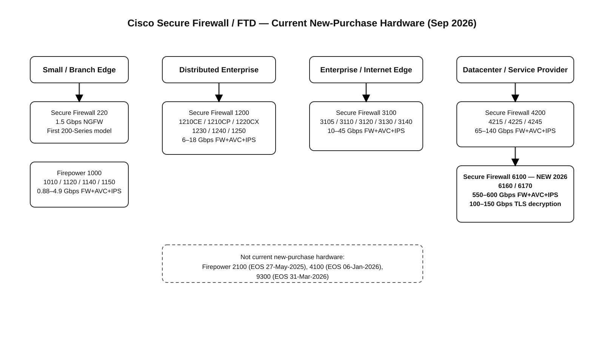
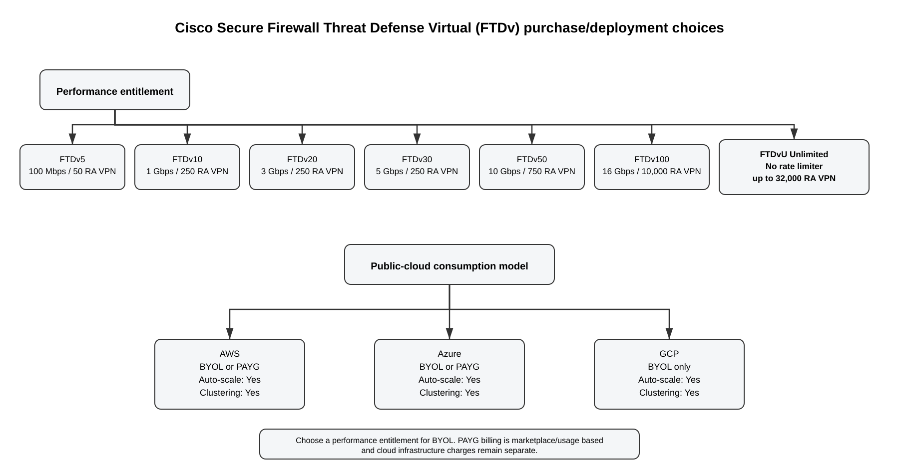
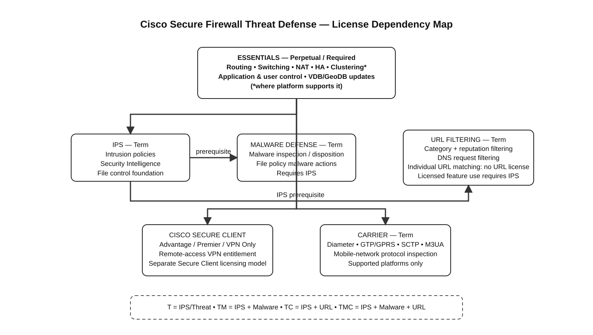

# Cisco Secure Firewall Threat Defense — Current Models and Licensing (September 2026)

## Table of Contents

- [Executive summary](#executive-summary)
- [1. What is actually current and orderable](#1-what-is-actually-current-and-orderable)
- [2. Current physical FTD-capable appliance families](#2-current-physical-ftd-capable-appliance-families)
  - [2.1 Secure Firewall 220](#21-secure-firewall-220)
  - [2.2 Firepower 1000 Series](#22-firepower-1000-series)
  - [2.3 Secure Firewall 1200 Series](#23-secure-firewall-1200-series)
  - [2.4 Secure Firewall 3100 Series](#24-secure-firewall-3100-series)
  - [2.5 Secure Firewall 4200 Series](#25-secure-firewall-4200-series)
  - [2.6 Secure Firewall 6100 Series](#26-secure-firewall-6100-series)
- [3. Platforms you should not treat as new-purchase choices](#3-platforms-you-should-not-treat-as-new-purchase-choices)
- [4. FTD virtual purchasing options](#4-ftd-virtual-purchasing-options)
  - [4.1 Performance-license tiers](#41-performance-license-tiers)
  - [4.2 FTDvU Unlimited tier](#42-ftdvu-unlimited-tier)
  - [4.3 AWS purchase and deployment options](#43-aws-purchase-and-deployment-options)
  - [4.4 Azure purchase and deployment options](#44-azure-purchase-and-deployment-options)
  - [4.5 GCP purchase and deployment options](#45-gcp-purchase-and-deployment-options)
  - [4.6 BYOL versus PAYG](#46-byol-versus-payg)
  - [4.7 Private-cloud and hypervisor options](#47-private-cloud-and-hypervisor-options)
- [5. Complete FTD feature-license model](#5-complete-ftd-feature-license-model)
- [6. What each license actually unlocks](#6-what-each-license-actually-unlocks)
- [7. Ordering bundle shorthand: T, TM, TC, TMC](#7-ordering-bundle-shorthand-t-tm-tc-tmc)
- [8. Secure Client / remote-access VPN licensing](#8-secure-client--remote-access-vpn-licensing)
- [9. Management licensing: FMC hardware, FMCv, and Security Cloud Control](#9-management-licensing-fmc-hardware-fmcv-and-security-cloud-control)
- [10. Security Analytics and Logging](#10-security-analytics-and-logging)
- [11. What I would buy for each use case](#11-what-i-would-buy-for-each-use-case)
- [12. Important ordering and licensing caveats](#12-important-ordering-and-licensing-caveats)
- [13. Verification checklist before purchase](#13-verification-checklist-before-purchase)
- [14. References](#14-references)

## Executive summary

As of **September 2026**, Cisco's current new-purchase FTD-capable physical portfolio is centered on the **Secure Firewall 220**, **Firepower 1000**, **Secure Firewall 1200**, **Secure Firewall 3100**, **Secure Firewall 4200**, and the new **Secure Firewall 6100** families. The 6100 Series, released in 2026, is the current top-end platform family. Firepower 2100, 4100, and 9300 should no longer be treated as new-purchase choices because they have passed their Cisco end-of-sale dates.

For FTD software, Cisco's current license names are:

1. **Essentials** — required/core, generally perpetual.
2. **IPS** — subscription.
3. **Malware Defense** — subscription; requires IPS for file-policy malware features.
4. **URL Filtering** — subscription; category/reputation filtering; Cisco documents IPS as a prerequisite for licensed URL functionality.
5. **Cisco Secure Client** — separate entitlement for remote-access VPN; Advantage, Premier, or VPN Only depending design.
6. **Carrier** — subscription on supported platforms for Diameter, GTP/GPRS, SCTP, and M3UA inspection.

Cisco ordering SKUs still commonly use the legacy shorthand **T**, **TM**, **TC**, and **TMC**, where **T = Threat/IPS + Security Intelligence**, **M = Malware**, and **C = URL**. This is why a quote can say “Threat” while the management GUI and newer documentation say “IPS.”

For **FTDv**, Cisco currently offers performance-tiered entitlements from **FTDv5 through FTDv100**, plus **FTDvU (Unlimited)** for VMware and KVM on Threat Defense 10.0. AWS and Azure support both **BYOL and PAYG**, while GCP is **BYOL-only** in Cisco's current public-cloud compatibility matrix.



[Editable draw.io](../images/09-09-26-20-07_ftd_current_platform_lineup.drawio)

## 1. What is actually current and orderable

The most important distinction is between a platform that remains documented/supported and one that Cisco still sells new.

| Family | Current new-purchase status in Sep 2026 | Models | Primary positioning |
|---|---|---|---|
| Secure Firewall 200 | **Orderable** | 220 | Cost-sensitive small branch / distributed edge |
| Firepower 1000 | **Orderable** | 1010, 1120, 1140, 1150 | Small office through branch |
| Secure Firewall 1200 | **Orderable** | 1210CE, 1210CP, 1220CX, 1230, 1240, 1250 | Modern branch / distributed enterprise |
| Secure Firewall 3100 | **Orderable** | 3105, 3110, 3120, 3130, 3140 | Enterprise branch, campus edge, Internet edge |
| Secure Firewall 4200 | **Orderable** | 4215, 4225, 4245 | High-performance enterprise/datacenter |
| Secure Firewall 6100 | **Orderable; newest high-end family** | 6160, 6170 | Datacenter / service provider / very high throughput |
| Firepower 2100 | **End of sale** | 2110, 2120, 2130, 2140 | Legacy/support only |
| Firepower 4100 | **End of sale 6-Jan-2026** | 4112, 4115, 4125, 4145 | Legacy/support only |
| Firepower 9300 | **End of sale 31-Mar-2026** | chassis + security modules | Legacy/support only |

The Cisco Network Security Ordering Guide may still contain tables for older products because those sections remain useful for installed-base renewals, spares, migration, or historical ordering. Do not equate presence in the ordering guide with current new-hardware availability.

## 2. Current physical FTD-capable appliance families

### 2.1 Secure Firewall 220

The **Secure Firewall 220** is the first member of the 200 Series and was introduced in 2026.

| Attribute | CSF220 |
|---|---:|
| Form factor | Compact desktop; optional wall/rack mounting |
| Data interfaces | 4 × 1G RJ-45 + 1 × 1G SFP |
| NGFW / FW+AVC+IPS | 1.5 Gbps |
| IPsec VPN | 1.2 Gbps |
| TLS decryption | 0.7 Gbps |
| Minimum software | Threat Defense 10.0.0+ or ASA 9.24+ |

**FTD ordering family:** `CSF220...`

Common Threat Defense subscription choices include:

- `CSF220T-T` — IPS/Threat.
- `CSF220T-TM` — IPS + Malware Defense.
- `CSF220T-TC` — IPS + URL Filtering.
- `CSF220T-TMC` — IPS + Malware Defense + URL Filtering.
- A-la-carte Malware and URL SKUs also exist, subject to prerequisites.
- Terms are 1, 3, or 5 years.

### 2.2 Firepower 1000 Series

This is the older but still orderable low/midrange family.

| Model | FW + AVC + IPS | Typical use |
|---|---:|---|
| 1010 / 1010E | ~0.88 Gbps | Small office / very small branch |
| 1120 | 2.3 Gbps | Small branch |
| 1140 | 3.3 Gbps | Mid-size branch |
| 1150 | 4.9 Gbps | Larger branch / edge |

FTD-capable appliance PIDs include `FPR1010-NGFW-K9`, `FPR1120-NGFW-K9`, `FPR1140-NGFW-K9`, and `FPR1150-NGFW-K9`.

For a **new design**, compare 1000 pricing directly against the 1200 Series. The 1200 family is the newer branch architecture and offers materially higher inspection throughput.

### 2.3 Secure Firewall 1200 Series

The 1200 Series is the modern branch/distributed-enterprise family.

| Model | Form factor | FW + AVC + IPS | Notable hardware |
|---|---|---:|---|
| 1210CE | Compact | 6 Gbps | 8 × 1G RJ-45 |
| 1210CP | Compact | 6 Gbps | 8 × 1G RJ-45; 4 PoE ports, 120 W total |
| 1220CX | Compact | 9 Gbps | 8 × 1G RJ-45 + 2 × 1/10G SFP+ |
| 1230 | 1RU | 9 Gbps | 8 × 1G + 4 × 1/10G SFP+ |
| 1240 | 1RU | 12 Gbps | 8 × 1G + 4 × 1/10G SFP+ |
| 1250 | 1RU | 18 Gbps | 8 × 2.5G + 4 × 1/10G SFP+ |

Threat Defense appliance PIDs include:

- `CSF1210CE-TD-K9`
- `CSF1210CP-TD-K9`
- `CSF1220CX-TD-K9`
- `CSF1230-TD-K9`
- `CSF1240-TD-K9`
- `CSF1250-TD-K9`

Every model has the same basic subscription choices: `T`, `TM`, `TC`, `TMC`, plus a-la-carte Malware and URL SKUs. Terms are normally 1, 3, and 5 years.

**Important:** Cisco's current ordering guide includes references to a `CSF1260` subscription SKU even though the published 1200 hardware datasheet and appliance table list 1210CE/1210CP/1220CX/1230/1240/1250. Treat 1260 ordering references as something to verify in CCW with Cisco rather than assuming an orderable 1260 appliance exists.

### 2.4 Secure Firewall 3100 Series

| Model | FW + AVC + IPS | TLS | Approximate positioning |
|---|---:|---:|---|
| 3105 | 10 Gbps | 3.2 Gbps | Growing branch / enterprise edge |
| 3110 | 17 Gbps | 4.8 Gbps | Midrange enterprise |
| 3120 | 21 Gbps | 6.7 Gbps | Midrange enterprise |
| 3130 | 38 Gbps | 9.1 Gbps | Large enterprise |
| 3140 | 45 Gbps | 11.5 Gbps | Large enterprise / datacenter edge |

Orderable Threat Defense appliance PIDs include `FPR3105-NGFW-K9` through `FPR3140-NGFW-K9`.

Each model supports the standard FTD subscription matrix:

- `L-FPR31xxT-T=`
- `L-FPR31xxT-TM=`
- `L-FPR31xxT-TC=`
- `L-FPR31xxT-TMC=`
- `L-FPR31xxT-AMP=`
- `L-FPR31xxT-URL=`

Cisco specifically notes that the 3100 obtains its Essentials/Base entitlement as part of the appliance purchase rather than relying on the same automatic assignment behavior used by some older platforms.

### 2.5 Secure Firewall 4200 Series

| Model | FW + AVC + IPS | Sessions | Typical role |
|---|---:|---:|---|
| 4215 | 65 Gbps | 15 M | High-end enterprise / DC |
| 4225 | 80 Gbps | 30 M | Datacenter / Internet edge |
| 4245 | 140 Gbps | 60 M | Large datacenter / service edge |

All are 1RU and provide two network-module bays supporting high-speed interfaces up to 100G-class modules depending module selection.

Threat subscription families include `FPR4215T-*`, `FPR4225T-*`, and `FPR4245T-*`, with `T`, `TM`, `TC`, `TMC`, Malware/AMP, and URL variants and 1/3/5-year terms.

**Ordering-document caution:** Cisco's current ordering-guide table around the 4200 license descriptions contains visibly misaligned product-description text for several rows. Use the SKU pattern plus the platform-specific getting-started licensing page and CCW validation rather than trusting every description string in that table verbatim.

### 2.6 Secure Firewall 6100 Series

The **6100 Series is the major new 2026 high-end platform family** and is the key replacement direction for customers who previously would have considered 4100/9300-class deployments.

| Metric | 6160 | 6170 |
|---|---:|---:|
| FW + AVC | 600 Gbps | 700 Gbps |
| FW + AVC + IPS | 550 Gbps | 600 Gbps |
| IPsec VPN | 450 Gbps | 550 Gbps |
| TLS decryption | 100 Gbps | 150 Gbps |

Threat Defense appliance PIDs:

- `CSF6160-A-TD-K9`
- `CSF6170-A-TD-K9`

License families include:

- `CSF6160T-T`, `-TM`, `-TC`, `-TMC`, plus a-la-carte `AMP` and `URL`.
- `CSF6170T-T`, `-TM`, `-TC`, `-TMC`, plus a-la-carte `AMP` and `URL`.
- 1-, 3-, and 5-year subscriptions are supported by the ordering model.
- Carrier is available on this high-end family.

## 3. Platforms you should not treat as new-purchase choices

### Firepower 2100

Cisco lists the 2110/2120/2130/2140 as **End of Sale**, with the hardware end-of-sale date of **27-May-2025**. These may remain in installed environments, but they should not be used as a 2026 greenfield purchase target.

### Firepower 4100

The 4112/4115/4125/4145 family reached end of sale on **6-Jan-2026**. Existing customers can remain supported according to the lifecycle schedule, but Cisco no longer sells the affected hardware/licenses as new products.

### Firepower 9300

The 9300 family reached end of sale on **31-Mar-2026**. The 6100 Series is the current high-end family to evaluate for new projects.

## 4. FTD virtual purchasing options

Cisco Secure Firewall Threat Defense Virtual (**FTDv**) is the virtual form factor of Threat Defense. It can be purchased/deployed in private-cloud hypervisors and major public clouds. The important commercial distinction is between the **performance entitlement** and the **cloud consumption model**.



[Editable draw.io](../images/09-09-26-20-39_ftdv-purchase-options.drawio)

### 4.1 Performance-license tiers

Cisco's current FTDv performance tiers are:

| Tier | License rate limit | RA VPN session limit | Typical minimum/reference footprint |
|---|---:|---:|---|
| **FTDv5** | 100 Mbps | 50 | 4 vCPU / 8 GB RAM |
| **FTDv10** | 1 Gbps | 250 | 4 vCPU / 8 GB RAM |
| **FTDv20** | 3 Gbps | 250 | 4 vCPU / 8 GB RAM |
| **FTDv30** | 5 Gbps | 250 | 8 vCPU / 16 GB RAM |
| **FTDv50** | 10 Gbps | 750 | 12 vCPU / 24 GB RAM |
| **FTDv100** | 16 Gbps | 10,000 | 16 vCPU / 32 GB RAM |
| **FTDvU** | **No rate limiter** | 20,000 at 32 vCPU; 32,000 at 64 vCPU | 32 vCPU / 64 GB or 64 vCPU / 128 GB |

For the classic tiers, the entitlement rate limiter is a **license ceiling**, not a guarantee that every cloud VM size will deliver that throughput under every inspection workload. Actual throughput depends on vCPU, NIC, hypervisor/cloud instance, packet size, enabled inspection, TLS decryption, IPS policy, and traffic mix.

Cisco's historical/current ordering families use names such as `FTD-V-5S-*`, `FTD-V-10S-*`, `FTD-V-20S-*`, `FTD-V-30S-*`, `FTD-V-50S-*`, and `FTD-V-100S-*`. Final PIDs and term options should be validated in Cisco Commerce Workspace because Cisco periodically refreshes virtual-license SKU structures.

Unlike most physical appliances, **FTDv Base is subscription/performance-tier based** rather than simply inheriting a perpetual platform entitlement from purchased hardware.

### 4.2 FTDvU Unlimited tier

Threat Defense 10.0 introduced **FTDvU**, the Unlimited performance tier.

Cisco documents FTDvU as:

- supported on **VMware and KVM**;
- able to boot with up to **64 vCPUs**;
- **not subject to the normal FTDv license rate limiter**;
- limited to **20,000 RA VPN sessions** at 32 vCPU / 64 GB RAM;
- limited to **32,000 RA VPN sessions** at 64 vCPU / 128 GB RAM.

Do **not** treat FTDvU as an AWS/Azure/GCP marketplace tier merely because the general FTDv data sheet lists 64-vCPU maximum system requirements. Cisco's Threat Defense 10.0 feature documentation specifically identifies **VMware and KVM only** for the FTDvU feature.

### 4.3 AWS purchase and deployment options

Cisco's current compatibility matrix supports **both BYOL and PAYG on AWS**.

| AWS option | How Cisco licensing is obtained | Billing model | Practical meaning |
|---|---|---|---|
| **FTDv BYOL** | Purchase/own the Cisco FTDv entitlement separately | Cisco license/subscription + AWS EC2 infrastructure | Best when you want Cisco enterprise licensing/term control and license portability within supported rules |
| **FTDv PAYG** | License is consumed through AWS Marketplace | Hourly/usage-based marketplace charge + AWS infrastructure | No separate upfront FTDv platform-license purchase for that PAYG instance |

The AWS Marketplace currently lists separate Cisco offers for **Secure Firewall Threat Defense Virtual - BYOL** and **Secure Firewall Threat Defense Virtual - PAYG**.

For PAYG, AWS states that pricing is based on actual usage and that infrastructure charges are additional. Cisco's AWS PAYG listing also states that all licensed features are enabled under the usage-based model; pricing varies with the EC2 instance type selected. This is commercially different from BYOL, where the FTDv entitlement is supplied from the customer's Cisco licensing relationship.

AWS deployment capabilities currently include:

- BYOL: **Yes**
- PAYG: **Yes**
- Auto Scale: **Yes**
- High Availability / clustering: **Yes**
- Cisco Multicloud Defense orchestration: **Yes**
- FMC management: **Yes**
- FDM management: **Yes**

Threat Defense 10.0 also adds AWS **two-arm Multi-AZ cluster** support for applicable FTDv AWS deployments.

### 4.4 Azure purchase and deployment options

Cisco's current data sheet and Microsoft Marketplace both show **BYOL and PAYG** for Azure.

Microsoft Marketplace currently exposes the Cisco offer as **“Cisco Secure Firewall Threat Defense Virtual – BYOL and PAYG.”**

| Azure option | Cisco entitlement model | Billing implication |
|---|---|---|
| **BYOL** | Bring an FTDv license/entitlement purchased through Cisco/channel | Azure VM costs remain separate |
| **PAYG** | Consume the Cisco firewall licensing through the Azure marketplace offer | Marketplace/software usage + Azure infrastructure |

Azure deployment capabilities currently include:

- BYOL: **Yes**
- PAYG: **Yes**
- Auto Scale: **Yes**
- High Availability / clustering: **Yes**
- Cisco Multicloud Defense orchestration: **Yes**
- FMC management: **Yes**
- FDM management: **Yes**

Threat Defense 10.0 also introduced **Azure MANA NIC** support for selected Azure VM sizes, including `Standard_D8s_v5` and `Standard_D16s_v5` in Cisco's current feature documentation. Always check the release-specific Azure deployment guide before choosing a VM SKU because supported instance types and NIC capabilities can change.

Azure also has a dedicated **Secure Firewall Threat Defense for Azure Virtual WAN** marketplace/deployment option for designs where Cisco FTDv is inserted into Azure Virtual WAN. Treat that as a deployment architecture/offer, not as a new FTD security-license tier.

### 4.5 GCP purchase and deployment options

**GCP is BYOL-only** for FTDv in Cisco's current compatibility matrix and GCP deployment guide.

| GCP option | Supported? | Meaning |
|---|---|---|
| **BYOL** | **Yes** | Purchase/use a Cisco FTDv entitlement and deploy it on supported GCP Compute Engine machine types |
| **PAYG** | **No** | Cisco does not currently list PAYG for GCP FTDv |

Current GCP FTDv capabilities include:

- BYOL: **Yes**
- PAYG: **No**
- Auto Scale: **Yes**
- High Availability / clustering: **Yes**
- Cisco Multicloud Defense orchestration: **Yes**
- FMC management: **Yes**
- FDM management: **Yes** on supported releases

Cisco's 10.0 GCP guide documents a **maximum of 16 vCPUs per FTDv GCP instance**, which is another reason not to confuse the private-cloud FTDvU 32/64-vCPU tier with GCP deployment sizing.

GCP supports multiple compute-optimized and general-purpose machine types for FTDv. Because supported GCP machine types can change without notice, size the Cisco entitlement and GCP Compute Engine VM together using the current release-specific deployment guide.

### 4.6 BYOL versus PAYG

The simplest purchasing decision is:

```text
Need enterprise-controlled Cisco licensing / existing Cisco agreement?
        |
       Yes
        v
      BYOL
        |
        +--> choose FTDv entitlement tier
        +--> deploy on supported cloud/hypervisor VM
        +--> pay cloud infrastructure separately

Prefer cloud-native hourly consumption?
        |
       Yes
        v
      PAYG
        |
        +--> AWS or Azure currently supported
        +--> Cisco software charge through marketplace
        +--> cloud compute/network/storage charges still separate
```

**BYOL does not mean the cloud VM is free.** It means only that the Cisco software entitlement is supplied separately. You still pay AWS, Azure, or GCP for the underlying VM, disks, network interfaces, load balancers, data transfer, public addresses, and other cloud services used by the design.

**PAYG does not mean every Cisco product or management component is automatically included.** Confirm the exact marketplace offer, management model, support, Secure Client licensing, and any external services needed for the deployment.

### 4.7 Private-cloud and hypervisor options

Cisco's current FTDv data sheet lists these private-cloud/on-premises platforms:

- **VMware**
- **KVM**
- **OpenStack**
- **Nutanix**
- **Microsoft Hyper-V**

Threat Defense 10.0 added Microsoft Hyper-V support and the FTDvU Unlimited tier for VMware/KVM.

Cisco's public-cloud deployment summary also lists:

- AWS
- Azure
- GCP
- OCI
- Alibaba Cloud
- Megaport
- Equinix

The current compatibility matrix is not identical across clouds. For example, AWS/Azure/GCP support clustering and autoscaling, while other public-cloud environments have different feature combinations. Always use the platform-specific 10.x deployment guide rather than assuming a feature supported on AWS is supported on every FTDv target.

## 5. Complete FTD feature-license model



[Editable draw.io](../images/09-09-26-20-07_ftd_license_dependency_map.drawio)

| License | Duration | What it enables | Dependency / note |
|---|---|---|---|
| **Essentials** | Perpetual on physical appliances | Core firewalling/networking and baseline NGFW controls | Required |
| **IPS** | Term | Intrusion policy, Security Intelligence, file-control foundation | Required for Malware; Cisco also documents it as prerequisite for licensed URL use |
| **Malware Defense** | Term | Malware inspection and file-policy malware actions | IPS required |
| **URL Filtering** | Term | Category/reputation URL filtering and licensed DNS filtering | Exact URL matching can be done without URL subscription |
| **Secure Client** | Term/perpetual depending tier | Remote-access VPN entitlement | Separate Secure Client licensing |
| **Carrier** | Term | Diameter, GTP/GPRS, SCTP, M3UA | Supported platforms only |
| **Export-controlled crypto enablement** | Eligibility/registration control | Advanced encryption-dependent features | Not a normal paid security-service subscription |

## 6. What each license actually unlocks

### Essentials

Current Cisco documentation says Essentials covers the functions that are **not** behind optional term licenses. This includes, where supported by the platform/software:

- L3/L4 firewalling and access control.
- Switching and routing.
- NAT.
- DHCP relay.
- High availability.
- Clustering on platforms that support clustering.
- User conditions in access-control rules.
- Application conditions / AVC in access-control rules.
- VDB and GeoDB updates.
- Ability to download intrusion-rule updates, although IPS policy cannot be deployed without the IPS entitlement.

This is why an expired IPS/URL/Malware subscription does **not** turn an FTD into a brick. Core firewall/routing/NAT functions remain tied to Essentials.

### IPS

IPS is the current user-facing license name for what older ordering literature calls **Threat** (`T`). It enables:

- Intrusion detection/prevention policies.
- Snort rule enforcement.
- Security Intelligence.
- File-control features that form the basis for Malware Defense.

A useful distinction: **Security Intelligence belongs to the IPS/Threat entitlement, not the URL subscription.**

### Malware Defense

Enables malware analysis/disposition actions in file policies. The IPS entitlement is required for the relevant file-policy workflow.

In ordering PIDs, Cisco may still use **AMP** terminology even though the product-facing name is now **Malware Defense**.

### URL Filtering

Enables category- and reputation-based URL policy and licensed DNS request filtering.

A subtle but important point from Cisco's current licensing guide: **you can match/filter an individual URL without purchasing URL Filtering**. The paid subscription is needed when you want Cisco's category/reputation intelligence and related licensed URL functionality.

### Carrier

Carrier licenses enable mobile-network protocol inspection such as:

- Diameter
- GTP/GPRS
- SCTP
- M3UA

This is a specialist service-provider/mobile-core license and is not relevant to most enterprise deployments.

## 7. Ordering bundle shorthand: T, TM, TC, TMC

This is the quickest way to read a Cisco quote:

| Code | Modern interpretation | Contains |
|---|---|---|
| `T` | IPS / Threat | IPS + Security Intelligence |
| `TM` | IPS + Malware | T + Malware Defense |
| `TC` | IPS + URL | T + URL Filtering |
| `TMC` | Full traditional security-services bundle | IPS + Malware Defense + URL Filtering |
| `AMP` / `M` | Malware Defense a-la-carte | Malware component; prerequisites still apply |
| `URL` / `C` | URL Filtering a-la-carte | URL component; prerequisites still apply |

For most organizations wanting “all the traditional NGFW security subscriptions,” **TMC is the straightforward bundle**.

## 8. Secure Client / remote-access VPN licensing

FTD remote-access VPN uses the **Cisco Secure Client** licensing model rather than the T/TM/TC/TMC firewall-security subscription.

### Secure Client Advantage

Comparable to legacy AnyConnect Plus/Essentials. Cisco documents capabilities including:

- Core VPN services.
- Per-application VPN.
- Trusted Network Detection.
- Device context collection.
- FIPS support.
- Network Access Manager / 802.1X supplicant.
- Umbrella roaming module entitlement where applicable to the client package.

### Secure Client Premier

Includes Advantage plus advanced capabilities such as:

- Secure Firewall posture.
- ISE posture integration where separately licensed on ISE.
- Network Visibility Module.
- Management VPN Tunnel.
- Advanced/next-generation encryption features.
- SAML authentication support as defined by the Secure Client ordering guide.

### Secure Client VPN Only

A perpetual/headend/concurrent-connection licensing model intended for organizations that want Secure Client primarily for VPN and do not need the broader endpoint modules.

**Key buying distinction:** Advantage/Premier are generally based on unique users, while VPN Only is oriented around licensed headend concurrent connections. Read the current Secure Client Ordering Guide when sizing remote-access licensing; do not derive RA-VPN user counts from the firewall's TMC subscription.

## 9. Management licensing: FMC hardware, FMCv, and Security Cloud Control

You have three major management approaches for FTD.

### A. Physical Firewall Management Center

The newest physical FMC generation is the **x800 Series**:

- **FMC 1800**
- **FMC 2800**
- **FMC 4800**

The previous x700 generation (1700/2700/4700) entered an end-of-sale/end-of-life process in 2026, so x800 is the correct greenfield hardware direction.

Physical FMC appliances do not require a separate per-device FMC management license in the same way FMCv does; managed FTD devices still require their own feature subscriptions.

### B. FMC Virtual

Cisco lists FMCv licenses sized for:

- 2 devices
- 10 devices
- 25 devices
- 300 devices

The license determines how many managed devices the FMCv may manage. These licenses are **not additive** in the way many people expect. For example, two 2-device entitlements are not the compliant way to create a 4-device FMCv; Cisco directs customers to the appropriate larger tier.

FMCv HA requires two identical eligible FMCv licenses; the 2-device tier does not support FMCv HA according to Cisco's ordering guidance.

### C. Security Cloud Control + cloud-delivered FMC

Cisco renamed/repackaged the cloud management commercial model in 2026. The older **CDO-SEC-SUB** SKU reached end of sale on **30-Jun-2026**. The current purchasing model is **Security Cloud Control Firewall Management**.

Current structure:

1. **FWM-BASE** — base tenant subscription.
2. **Per-device management license** — tied to platform/model.
3. Optional logging model.
4. Cloud-delivered FMC is included with the Security Cloud Control Firewall Management base subscription; it is not purchased as a separate FMC license.

Cisco lists device-management PIDs such as:

- `FWM-CSF220`
- `FWM-FPR1010`, `FWM-FPR1120`, `FWM-FPR1140`, `FWM-FPR1150`
- `FWM-CSF1210CE`, `FWM-CSF1210P`, `FWM-CSF1220CX`, `FWM-CSF1230`, `FWM-CSF1240`, `FWM-CSF1250`
- `FWM-FPR3105` through `FWM-FPR3140`
- `FWM-FPR4215`, `FWM-FPR4225`, `FWM-FPR4245`
- `FWM-FPRTD-V` for virtual firewall management

Security Cloud Control management licensing is separate from the firewall feature subscription. In other words, paying for cloud management does **not** automatically grant IPS/Malware/URL licenses to the managed FTD.

## 10. Security Analytics and Logging

Cisco also offers **Security Analytics and Logging (SAL)** as a cloud logging/analytics entitlement associated with Security Cloud Control.

Current tiers documented in 2026 include:

| SAL tier | Storage allocation | Retention options |
|---|---:|---|
| Essentials | 2 TB | Up to 5 years depending purchased plan |
| Advantage | 4 TB | Up to 5 years |
| Premier | 10 TB | Up to 5 years |

Another management bundle option provides **per-device management plus unlimited cloud log storage for a rolling 90-day period**.

Cisco retired an older SAL-SUB Cloud SaaS license on 30-Jun-2026; use the current Security Cloud Control/SAL ordering guide when quoting rather than an old CDO/SAL SKU list.

## 11. What I would buy for each use case

| Requirement | Most logical current family |
|---|---|
| Tiny/cost-sensitive site | Secure Firewall 220 |
| Modern branch with high inspection throughput | 1210/1220/1230/1240/1250 depending ports and throughput |
| Existing low-end standardization / price-driven | Firepower 1000, but compare against 1200 before committing |
| Enterprise edge around 10–45 Gbps | Secure Firewall 3100 |
| Large enterprise/DC around 65–140 Gbps inspected throughput | Secure Firewall 4200 |
| Very-high-scale DC/service provider hundreds of Gbps | Secure Firewall 6160/6170 |
| Private VMware/KVM high-scale virtual firewall | **FTDvU** if Threat Defense 10.0+ and the design benefits from >16-vCPU scale/no license rate limiter |
| AWS virtual firewall with existing Cisco licensing | **FTDv BYOL** |
| AWS cloud-native hourly consumption | **FTDv PAYG** |
| Azure virtual firewall with existing Cisco licensing | **FTDv BYOL** |
| Azure cloud-native marketplace consumption | **FTDv PAYG** |
| GCP virtual firewall | **FTDv BYOL**; PAYG is not currently supported |
| Small number of locally managed appliances | FDM if the desired feature set/platform supports it |
| Centralized on-prem management | FMC 1800/2800/4800 or FMCv |
| Cloud-delivered central management | Security Cloud Control Firewall Management + included cloud-delivered FMC |

For a standard enterprise that wants the complete traditional security stack, the usual quote concept is:

**Appliance + Essentials + TMC (IPS + Malware + URL) + Secure Client if RA VPN is needed + support + management platform as required.**

For FTDv BYOL, replace the physical appliance purchase with the appropriate **FTDv performance entitlement**, then add the needed security-service subscriptions and cloud/hypervisor infrastructure.

## 12. Important ordering and licensing caveats

1. **Do not confuse “Threat” with a separate product from IPS.** In current Cisco naming, Threat-license ordering code `T` maps to the IPS/Security Intelligence capability set.
2. **TMC does not include Secure Client.** Remote-access VPN licensing is separate.
3. **Essentials is not an annual subscription on most physical appliances.** The optional security services are the term-based pieces.
4. **FTDv differs:** its Base entitlement is subscription/performance-tier based.
5. **FTDvU is currently a VMware/KVM Threat Defense 10.0+ capability, not a generic AWS/Azure/GCP unlimited tier.**
6. **AWS and Azure currently support FTDv BYOL and PAYG; GCP supports BYOL only.**
7. **PAYG software charges do not replace cloud infrastructure charges.** EC2/Azure VM, storage, networking, load balancers, data transfer, and other cloud services are billed separately.
8. **URL category/reputation filtering requires URL entitlement; exact URL matching itself does not.**
9. **Malware requires the IPS foundation.**
10. **Security Intelligence is tied to IPS/Threat, not the URL license.**
11. **Strong crypto/export-controlled functionality is an eligibility/registration issue, not simply “buy TMC.”** It can affect VPN/SSL functions.
12. **Cloud-delivered FMC is included with Security Cloud Control Firewall Management's base tenant subscription, but per-device management licensing is still required.**
13. **High-availability firewalls do not necessarily double every management entitlement.** Security Cloud Control documents an HA pair as one managed device for its device-license purpose; verify feature-license consumption separately for the specific deployment model.
14. **FMC hardware and FMCv licensing are different.** Physical FMC does not use the FMCv 2/10/25/300-device license model.
15. **A product appearing in Cisco documentation does not prove it is still orderable.** Always cross-check EoS and CCW.
16. **Support contracts are separate commercial items from security subscriptions.** Software/subscription support rules vary by management offer and Secure Client license type.
17. **Cisco ordering guides occasionally contain stale or misaligned descriptive strings.** Validate final PIDs in CCW, especially when a row description appears inconsistent with the SKU itself.

## 13. Verification checklist before purchase

Before signing a quote, validate all of the following:

| Check | What to verify |
|---|---|
| Hardware status | Cisco product page says Available Order, not End of Sale |
| FTD software support | Desired FTD release supports the platform |
| FTDv cloud/hypervisor | Exact AWS/Azure/GCP instance or hypervisor version is supported by the selected FTD release |
| FTDv commercial model | BYOL vs PAYG is supported on the selected cloud; GCP is currently BYOL-only |
| FTDv entitlement | FTDv5/10/20/30/50/100 or applicable FTDvU tier matches required throughput and RA-VPN scale |
| FTDvU applicability | VMware/KVM only for current 10.0 FTDvU support; do not quote it as a public-cloud marketplace tier without newer Cisco documentation |
| Management compatibility | FMC/FMCv/cloud-delivered FMC release supports that FTD release |
| Throughput metric | Size using FW+AVC+IPS and TLS, not only stateful firewall throughput |
| Interface requirements | Built-in ports plus required network modules/transceivers |
| HA/clustering | Platform supports the exact redundancy mode required |
| Core entitlement | Essentials/Base correctly included/assigned |
| Security subscription | T, TM, TC, or TMC matches required controls |
| RA VPN | Secure Client Advantage/Premier/VPN Only sized independently |
| Carrier | Only if GTP/Diameter/SCTP/M3UA inspection is required |
| Cloud management | FWM base tenant + correct per-device management SKUs |
| Cloud logging | 90-day unlimited-per-device model vs a-la-carte SAL retention/storage |
| Smart Account | Correct customer Smart Account/Virtual Account selected before fulfillment |
| Export crypto | Strong-crypto eligibility/registration confirmed |
| Term | 1/3/5-year firewall subscription selected as required |
| Support | Appropriate Cisco support entitlement attached |

## 14. References

Primary Cisco references used for this guide:

- Cisco Network Security Ordering Guide: https://www.cisco.com/c/en/us/products/collateral/security/secure-firewall/guide-c07-737902.html
- Cisco Secure Firewall Threat Defense Virtual Data Sheet: https://www.cisco.com/c/en/us/products/collateral/security/firewalls/threat-defense-virtual-ds.html
- Threat Defense Virtual 10.0 Getting Started Guide / What's New: https://www.cisco.com/c/en/us/td/docs/security/firepower/quick_start/consolidated_ftdv_gsg/threat-defense-virtual-10-0-gsg/m_what-s-new-in-10-0-0-1.html
- Threat Defense Virtual 10.0 GCP Deployment Guide: https://www.cisco.com/c/en/us/td/docs/security/firepower/quick_start/consolidated_ftdv_gsg/threat-defense-virtual-10-0-gsg/m-ftdv-gsg-gcp.html
- Firewall Threat Defense Virtual Licenses: https://docs.manage.security.cisco.com/cdfmc/r_ftdv-licensing-fmc.html
- AWS Marketplace — Cisco Secure Firewall Threat Defense Virtual BYOL: https://aws.amazon.com/marketplace/pp/prodview-p2336sqyya34e
- AWS Marketplace — Cisco Secure Firewall Threat Defense Virtual PAYG: https://aws.amazon.com/marketplace/pp/prodview-agotwrhawevmc
- Microsoft Marketplace — Cisco Secure Firewall Threat Defense Virtual BYOL and PAYG: https://marketplace.microsoft.com/en-us/product/cisco.cisco-firepower-threat-defense-appliance
- Microsoft Marketplace — Cisco Secure Firewall Threat Defense for Azure Virtual WAN: https://marketplace.microsoft.com/marketplace/apps/cisco.cisco-tdv-for-vwan
- Secure Firewall 220 Data Sheet: https://www.cisco.com/c/en/us/products/collateral/security/firewalls/secure-firewall-200-series/secure-firewall-220-ds.html
- Secure Firewall 1200 Series Data Sheet: https://www.cisco.com/c/en/us/products/collateral/security/firewalls/secure-firewall-1200-series-ds.html
- Secure Firewall 3100 Series Data Sheet: https://www.cisco.com/c/en/us/products/collateral/security/firewalls/secure-firewall-3100-series-ds.html
- Secure Firewall 4200 Data Sheet: https://www.cisco.com/c/en/us/products/collateral/security/firewalls/secure-firewall-4200-ds.html
- Secure Firewall 6100 Series Data Sheet: https://www.cisco.com/c/en/us/products/collateral/security/firewalls/secure-firewall-6100-series/secure-firewall-6100-series-ds.html
- Firepower 1000 Series Data Sheet: https://www.cisco.com/c/en/us/products/collateral/security/firepower-1000-series/datasheet-c78-742469.html
- FTD 10.x FDM Licensing: https://www.cisco.com/c/en/us/td/docs/security/firepower/10-0/fdm/fptd-fdm-config-guide-10-0/fptd-fdm-license.html
- Current Security Cloud Control / cloud-delivered FMC licensing: https://www.cisco.com/c/en/us/td/docs/security/cdo/cloud-delivered-firewall-management-center-in-cdo/managing-firewall-threat-defense-services-with-cisco-defense-orchestrator/system-licenses.html
- Security Cloud Control Firewall Management Ordering Guide: https://www.cisco.com/c/en/us/products/collateral/security/security-cloud-control/security-cloud-control-firewall-management-og.html
- Secure Client Ordering Guide: https://www.cisco.com/c/en/us/products/collateral/security/anyconnect-secure-mobility-client/secure-client-og.html
- FMC x800 Series Data Sheet: https://www.cisco.com/c/en/us/products/collateral/security/firesight-management-center/x800-series-ds.html
- Firepower 2100 End-of-Sale status: https://www.cisco.com/c/en/us/support/security/firepower-2100-series/series.html
- Firepower 4100 EoS/EoL: https://www.cisco.com/c/en/us/products/collateral/security/firepower-ngfw/firepower-4100-series-security-appliances-eol.html
- Firepower 9300 EoS/EoL: https://www.cisco.com/c/en/us/products/collateral/security/firepower-ngfw/firepower-9300-series-security-appliances-eol.html
- CDO-SEC-SUB EoS/EoL: https://www.cisco.com/c/en/us/products/collateral/security/firewalls/defense-orchestrator-saas-license-cdo-sec-sub-eol.html
- SAL SaaS license EoS/EoL: https://www.cisco.com/c/en/us/products/collateral/security/firewalls/sal-sub-cloud-saas-license-eol.html
- Cisco Community licensing guide: https://community.cisco.com/t5/security-knowledge-base/cisco-security-licensing-guide/ta-p/4445140
- Cisco Community — Security Cloud Control updates: https://community.cisco.com/t5/security-knowledge-base/what-s-new-for-security-cloud-control-firewall-management/ta-p/4066742

### Source information vs explanation

**Source information:** Model names, measured Cisco performance figures, FTDv performance tiers, public-cloud BYOL/PAYG support, license names, subscription dependencies, PIDs, management licensing structure, and EoS dates above are taken from the cited Cisco/vendor marketplace material.

**Additional explanation:** The use-case sizing, BYOL-versus-PAYG interpretation, and plain-English interpretation of T/TM/TC/TMC are explanatory mappings of Cisco's documented license terminology.

**Reasonable inference:** Describing the 6100 as the practical current replacement direction for very-high-end 4100/9300-class greenfield purchasing is an architectural/commercial inference based on the 6100's 2026 release, performance tier, and the 4100/9300 EoS dates; it is not presented as a Cisco statement that every 4100/9300 design maps one-for-one to a 6100.